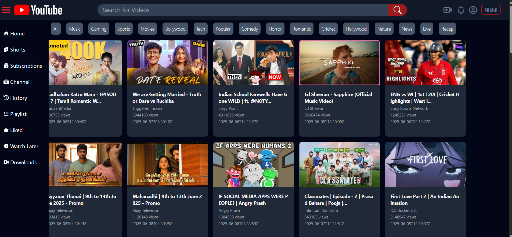
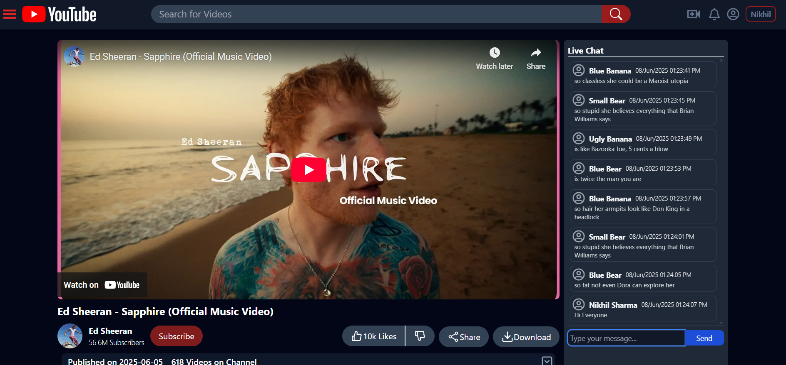
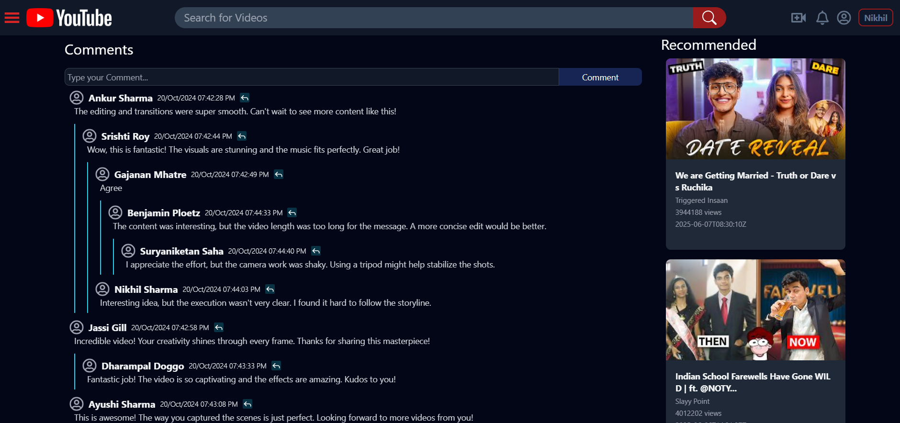

<h1 align="center" id="title">📺 You2ube - YouTube UI Clone 📺</h1>

<p align="center" id="description"><em>A polished clone of the YouTube UI built using ReactJS, Tailwind CSS, Redux Toolkit, and Firebase. Implements a dynamic video browsing and watching experience with live chat simulation and nested comments. Deployed on Firebase.</em></p>

---

## ✅ **🧐 Key Features at a Glance**

You2ube offers a familiar yet lightweight version of the original YouTube UI, with features such as:

1. 🔍 **YouTube API Integration** – Fetches and displays trending videos, video details, and suggestions  
2. 💬 **Live Chat Simulation** – Dynamic chatbox on video page mimics real-time user messages  
3. 🧵 **Nested Comments Section** – Multi-level replies and comment threads  
4. 🏠 **Homepage & Video Page** – Fully responsive and interactive design  
5. 📚 **Search Suggestions** – Auto-suggest search bar with caching logic  
6. 🧭 **Sidebar Navigation** – Includes sections like Home, Shorts, Subscriptions  
7. 📱 **Responsive Design** – Mobile-friendly layout via Tailwind  
8. 📦 **Redux Toolkit** – Efficient and scalable state management  

---

## 💚 **🛠️ Technologies & Tools Used**

### 🔧 **Frontend & UI**
- ⚛️ **ReactJS** – Functional components and Hooks for UI rendering  
- 🎨 **Tailwind CSS** – Utility-first CSS framework for rapid UI development  
- 🗂️ **Redux Toolkit** – Centralized state management  
- 🔃 **React Router DOM** – Seamless routing for SPA navigation  
- 🧠 **React Icons** – Icon library for buttons and UI  
- 📅 **date-and-time** – Format timestamps and chat time

### 🔌 **APIs & Backend**
- 🎥 **YouTube Data API v3** – Fetch trending videos, video/channel details  
- 💾 **Firebase** – Hosting and deployment  

### 🧪 **Testing & Utilities**
- 🧪 **Jest** – Unit testing framework  
- 🧪 **React Testing Library** – Component testing utilities

---

## 💻 **Built With**

```text
ReactJS, Tailwind CSS, Redux Toolkit, React Router DOM, React Icons,
YouTube Data API, Firebase, Jest, date-and-time, HTML, CSS, JS
```

---

## 🚀 **Deployment**

- ☁️ **Hosted on**: [Firebase](https://firebase.google.com)  
- 🔗 **Fully Integrated**: All assets bundled via React + Vite build and deployed using Firebase CLI  
- ⚙️ **Environment Setup**: `.env` file used for storing API keys and configurations

---

## 📷 **Screenshots**

### 🏠 Homepage View


### ▶️ Video Watch Page with LiveChat


### 🧵 Comments Section with Recommendation


---

## 📣 **Feedback & Contributions**

We welcome feedback and contributions!

- 🛠️ Submit Pull Requests for improvements  
- 🐞 Open GitHub Issues for bugs or feature requests  
- 📧 Reach out via Gmail for questions or collaboration opportunities

---
